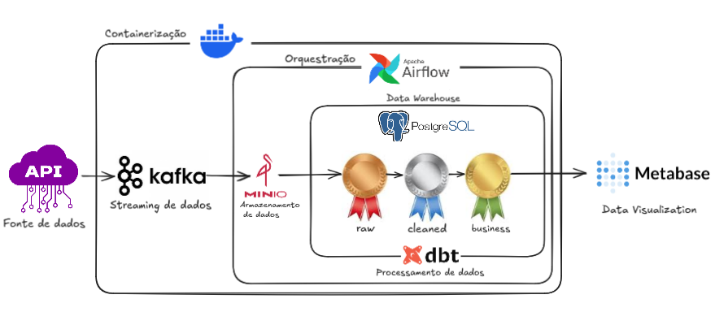

# Stock Market Data Pipeline

Pipeline de engenharia de dados end-to-end para ingestão, processamento, modelagem analítica e visualização de dados do mercado financeiro, utilizando Kafka, MinIO, Airflow, dbt, PostgreSQL e Metabase.

O projeto implementa a Medallion Architecture (Bronze / Silver / Gold) inteiramente dentro do PostgreSQL, sem dependência de plataformas proprietárias como Snowflake ou Databricks.

## Arquitetura

### Componentes

- Kafka: streaming de dados de mercado (quotes)
- MinIO: armazenamento intermediário / data lake
- PostgreSQL: data warehouse analítico
- dbt: transformação e modelagem dos dados
- Airflow: orquestração dos pipelines
- Metabase: visualização e dashboards
- Docker: containerização do ambiente

## Estrutura do projeto

        ├── producer/                 # Producer Kafka (Python)
        ├── consumer/                 # Consumer Kafka → MinIO/Postgres
        ├── dags/                     # DAGs do Airflow
        ├── dbt_stocks/
        │   └── dbt_stocks/
        │       ├── models/
        │       │   ├── bronze/       # Views (schema bronze)
        │       │   ├── silver/       # Tables (schema silver)
        │       │   └── gold/         # Tables (schema gold)
        │       ├── macros/
        │       ├── tests/
        │       └── dbt_project.yml
        ├── docker-compose.yml
        ├── scripts/
        │   └── create.sql            # Criação de schemas
        └── README.md

## Requisitos e execução do projeto

Execute o comando 

    docker compose up -d
